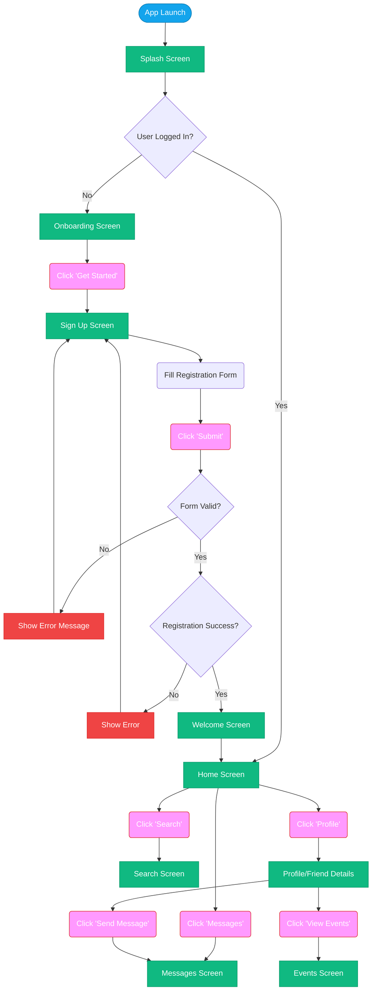
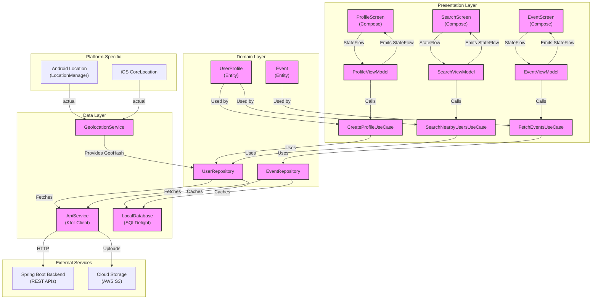
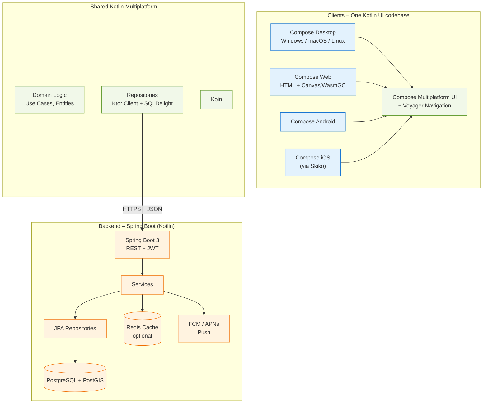
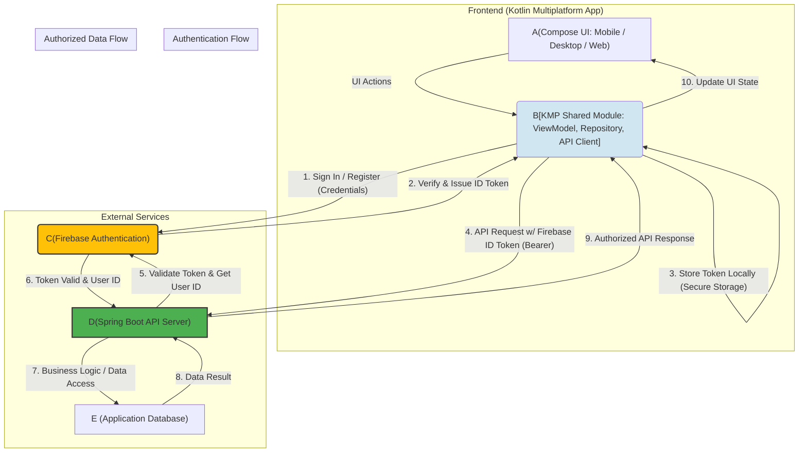
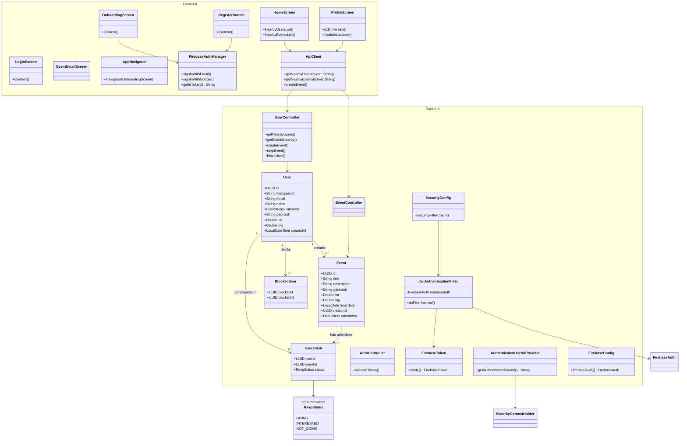
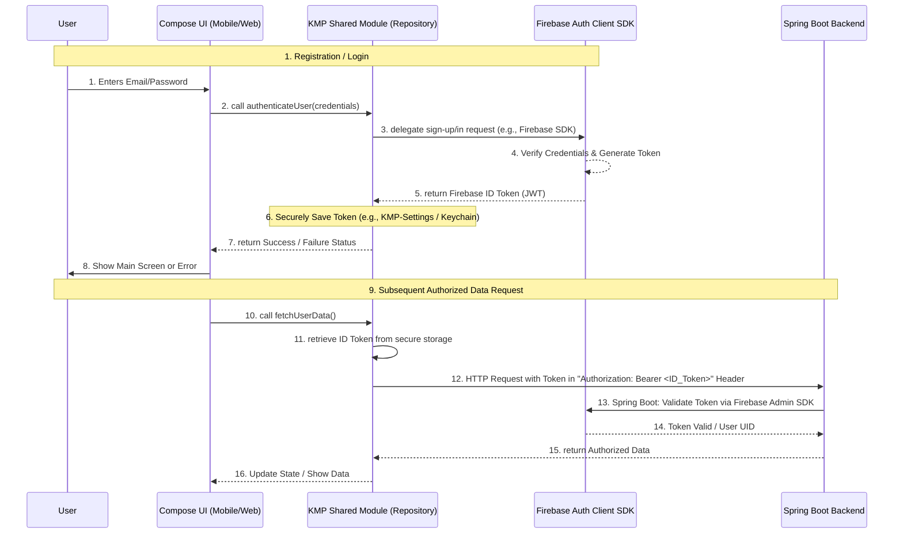

# FriendSpark

## About app

An app that allows user to find friends and events nearby based on user’s interests.

When potential user registers a personal account in app, he/she then is able to search for people or events nearly to find potential friends or events.

The app doesn't show the exact geolocation of people.

## Identification of the problem

### 1. What’s the main goal of the app?

The main goal of FriendSpark is to facilitate meaningful connections by helping users discover and interact with potential friends nearby who share similar interests or hobbies. It focuses on creating a safe, privacy-conscious platform where users can build platonic relationships through profile matching, interest-based filtering, and event discovery, without revealing exact geolocation data.

### 2. What problem does the app solve?

FriendSpark solves the challenge of social isolation and difficulty in forming new friendships in adulthood or after life changes (e.g., moving to a new city). It addresses the lack of easy, low-pressure ways to meet like-minded people locally, reducing reliance on chance encounters or awkward in-person networking.

### 3. Who faces this problem, and how does it impact their daily lives?

This problem primarily affects young adults (18-35), expats, remote workers, and newcomers to cities who struggle with building social circles beyond work or family. It impacts daily lives by leading to loneliness, reduced mental well-being, and missed opportunities for shared activities like hobbies or events, often resulting in more screen time on passive social media without real-world connections.

### 4. Are there any existing solutions to this problem, and how can your app improve on them?

Existing solutions include Bumble BFF (for platonic matching), Hey! VINA (women-focused friend-finding), Meetup (event-based groups), Nextdoor (neighborhood networking), and Zingr (location-based discovery). FriendSpark can improve by emphasizing privacy through approximate geohashing (unlike exact location sharing in some apps), integrating event discovery with friend matching in one seamless flow, and offering cross-platform support (Android, iOS, web, desktop) for broader accessibility. It could also enhance matching algorithms with hobby-specific filters to reduce mismatched connections, addressing complaints about superficial swiping in apps like Bumble BFF.

### 5. How will this app make users’ lives easier, more efficient, or more enjoyable?

FriendSpark will make lives easier by providing a quick, interest-driven way to find local connections, saving time on manual searches or awkward meetups. It enhances efficiency through filtered searches and event suggestions, reducing the effort to plan social activities. For enjoyment, it fosters genuine interactions based on shared hobbies, helping users build fulfilling relationships and participate in fun events, ultimately boosting happiness and combating loneliness.

### 6. How does this app align with the company’s larger mission and values?

Assuming your project represents a personal or startup mission focused on fostering authentic human connections in a digital world (as implied by the app's emphasis on privacy and interest-based matching), FriendSpark aligns by promoting inclusive, safe social networking that values user privacy and real-world engagement over superficial interactions. It supports values like community-building, accessibility (multiplatform), and innovation (geohashing for anonymity), contributing to a broader goal of reducing social isolation through technology.

### Important notes

- Mandatory: Android, iOS, Web
- Optional: Windows, MacOS, Linux

## Functionality

- Search for potential friends nearby
- Use a filter to find people with certain interests or hobbies
- Create profile:
    - Required: photo, range of age, name, interests or hobbies
    - Optional: address
- View user profile details: name, photo, interests or hobbies
- Search for events that are taking place or will take place soon
- View event details:
    - Name
    - Description
    - Photo
    - Duration
    - Repeat
    - Prices (if paid)

## Must have features

- Goggle/Apple login
- Multi-language (start with EN, RU)
- Light/Dark theme

## Possible features

- Feature voting: user can add (if not exists yet) a new possible feature and explanation why it should be added
- Subscribe to the new events or people: when new user or event appears nearby, user will be notified about it

# Design

See: https://www.figma.com/resource-library/how-to-design-an-app/ as reference guide

## Screens

1. **Sign-In**: Email/password/interests fields, "Sign In" button and Goggle/Apple buttons
2. **Log-In**: Email/password, "Log In" button and Goggle/Apple buttons
3. **Home**: Menu Bar, Nearby friends list, events cards, search FAB
4. **Profile**:Photo, name, age range, interests tags
5. **Search**: Menu Bar, Filters (interests, distance), results grid

## Pictures

Different pictures where two and more persons (m/w, m/m, w/w, etc) are doing what they love: running, walking, hiking, playing computer games, etc.

[Untitled](https://www.notion.so/2835fb66f399804a9f12d2b6c2cf1eba?pvs=21)

# MVP Implementation Priority

**Phase 1 (Weeks 1-4):**
•	User registration/authentication
•	Basic profile creation
•	Simple proximity search
•	Basic mobile app with core screens
**Phase 2 (Weeks 5-8):**
•	Interest-based filtering
•	Event creation and search
•	Enhanced profile features
•	Web application
**Phase 3 (Weeks 9-12):**
•	Advanced matching algorithms
•	Push notifications
•	Performance optimizations
•	Analytics integration

## User flow diagram



## Component Communication Diagram

```mermaid
graph TD
    %% === Frontend (KMP) Section ===
    subgraph KMP_Frontend["Kotlin Multiplatform Frontend"]
        subgraph ComposeApp["ComposeApp Module"]
            UI["UI: @Composable Screens<br>(SignIn, Home, Profile, Search)"]
            ViewModels["ViewModels: SignInViewModel, HomeViewModel<br>(Koin Injected)"]
            Navigation[Navigation: Voyager/Decompose]
        end

        subgraph Shared["Shared Module"]
            Domain["Domain: Entities (UserProfile, Event)<br>Use Cases"]
            Data["Data: Repositories, Ktor Client<br>SQLDelight (Local DB)"]
            DI[DI: Koin Modules]
        end

        subgraph Android["Android Module"]
            AndroidEntry[Android Entry: MainActivity]
            Permissions[Permissions: Location, Notifications]
            WorkManager[WorkManager: Sync Tasks]
        end

        subgraph iOS["iOS Module"]
            iOSEntry[iOS Entry: MainViewController]
            CoreLocation[CoreLocation: Geolocation]
            BackgroundTasks[Background Tasks: Sync]
        end

        UI --> ViewModels
        ViewModels --> Data
        Data --> DI
        AndroidEntry --> UI
        iOSEntry --> UI
        Permissions --> Data
        WorkManager --> Data
        CoreLocation --> Data
        BackgroundTasks --> Data
    end

    %% === Backend (Spring Boot) Section ===
    subgraph SpringBoot_Backend["Spring Boot Backend API"]
        subgraph Presentation["Presentation Layer"]
            UserController[UserController: /api/users/nearby]
            AuthController[AuthController: /api/auth/login]
            EventController[EventController: /api/events]
        end

        subgraph Service["Service Layer"]
            UserService[UserService: Business Logic]
            AuthService[AuthService: JWT Generation]
            EventService[EventService: Event Management]
        end

        subgraph DataAccess["Data Access Layer"]
            UserRepository[UserRepository: JPA Queries]
            EventRepository[EventRepository: JPA Queries]
        end

        subgraph Security["Security Layer"]
            SpringSecurity[Spring Security: JWT Filter]
            SecurityConfig[SecurityConfig: @EnableWebSecurity]
        end

        UserController --> UserService
        AuthController --> AuthService
        EventController --> EventService
        UserService --> UserRepository
        AuthService --> UserRepository
        EventService --> EventRepository
        UserController --> Security
        AuthController --> Security
        EventController --> Security
    end

    %% === Database Section ===
    subgraph Database["PostgreSQL Database"]
        UsersTable[users: id, email, name, interests, geohash]
        EventsTable[events: id, title, location_geohash, date, creator_id]
        UserEventsTable[user_events: user_id, event_id, rsvp_status]
        BlockedUsersTable[blocked_users: blocker_id, blocked_id]
        
        UsersTable --> UserRepository
        EventsTable --> EventRepository
        UserEventsTable --> UserRepository
        UserEventsTable --> EventRepository
        BlockedUsersTable --> UserRepository
    end

    %% === External Integrations Section ===
    subgraph Integrations["External Integrations"]
        GeohashService[Geohash Service]
        FCM[FCM: Push Notifications]
    end

    %% === Data Flow ===
    UI -->|"HTTP Request (GET /api/users/nearby)"| UserController
    Data -->|HTTP Request| AuthController
    Data -->|HTTP Request| EventController
    UserRepository -->|SQL Query| UsersTable
    EventRepository -->|SQL Query| EventsTable
    UserService -->|Geohash Logic| GeohashService
    UserService -->|Notification Trigger| FCM
    Data -->|Local Sync| UsersTable
    Data -->|Local Sync| EventsTable

    %% === Notes ===
    classDef frontend fill:#f9f,stroke:#333,stroke-width:2px;
    classDef backend fill:#bbf,stroke:#333,stroke-width:2px;
    classDef database fill:#bfb,stroke:#333,stroke-width:2px;
    classDef integrations fill:#ffb,stroke:#333,stroke-width:2px;
    class KMP_Frontend,ComposeApp,Shared,Android,iOS frontend;
    class SpringBoot_Backend,Presentation,Service,DataAccess,Security backend;
    class Database,UsersTable,EventsTable,UserEventsTable,BlockedUsersTable database;
    class Integrations,GeohashService,FCM integrations;
```





## Final Architecture Diagram





## Class Diagram



## Authentication/Authorization Flow



### Helpful commands:

Backend CRUD + Auth (JWT):

```bash
./gradlew :backend:bootRun
```

Desktop app with Onboarding + Register:

```bash
./gradlew :composeApp:run
```

Web version (same code):

```bash
./gradlew :composeApp:jsBrowserDevelopmentRun
```

Add Android + iOS targets (zero UI changes):

```bash
./gradlew :composeApp:iosX64Binaries
```